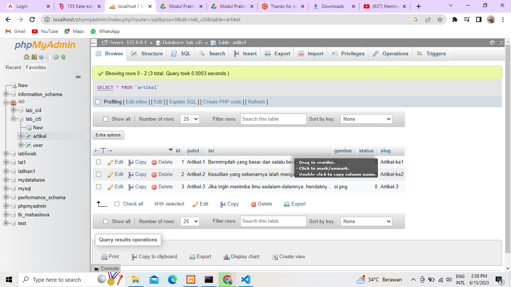
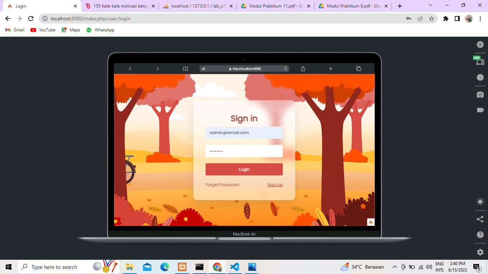
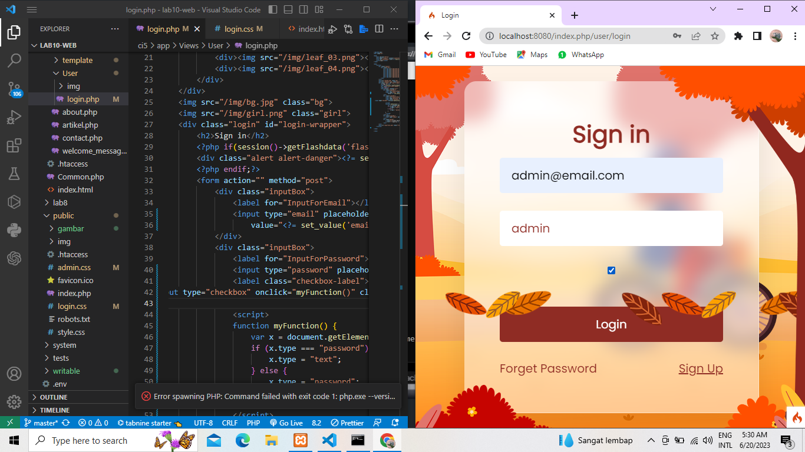
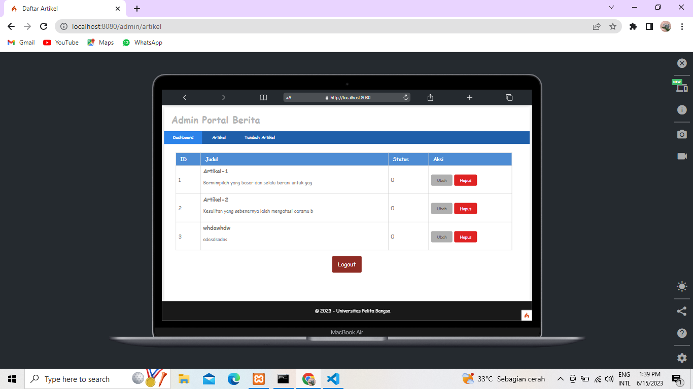
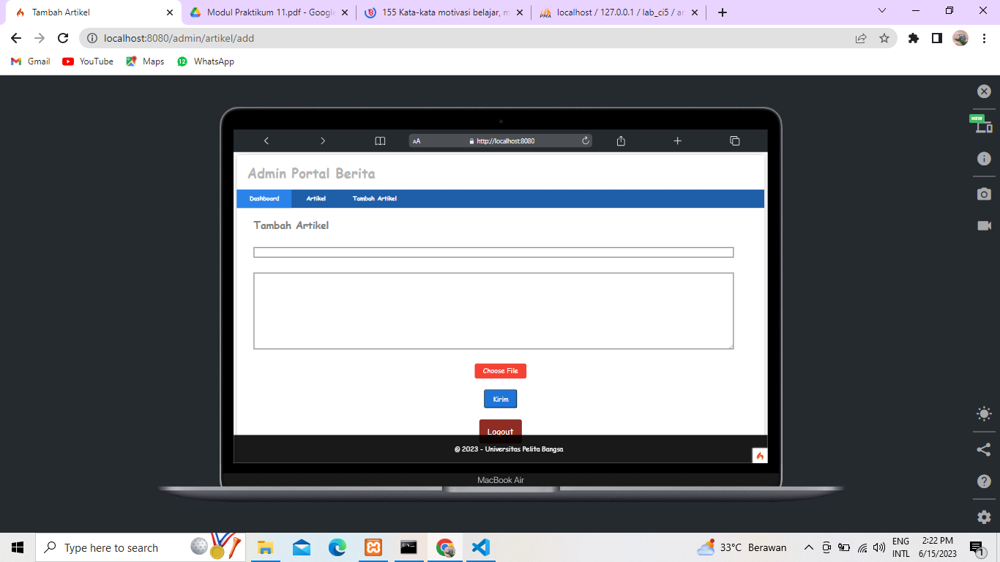
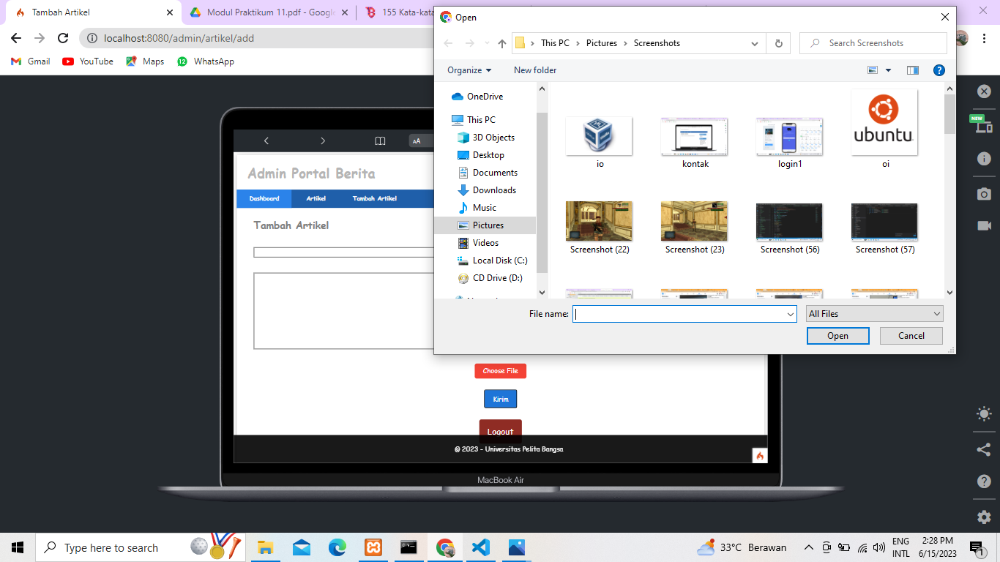
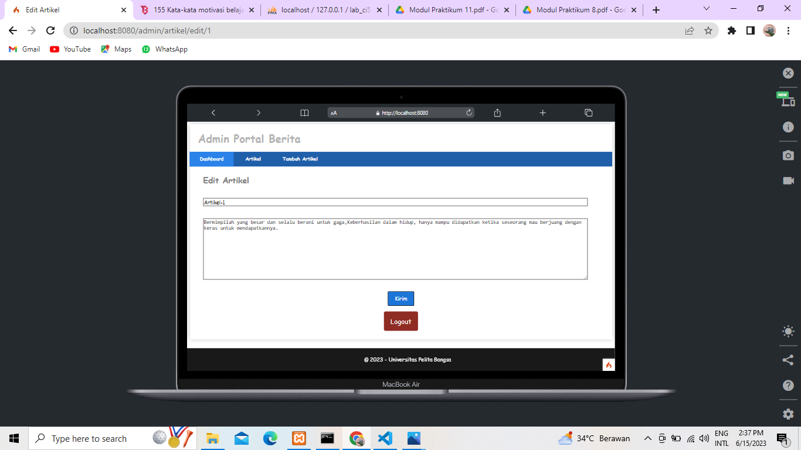
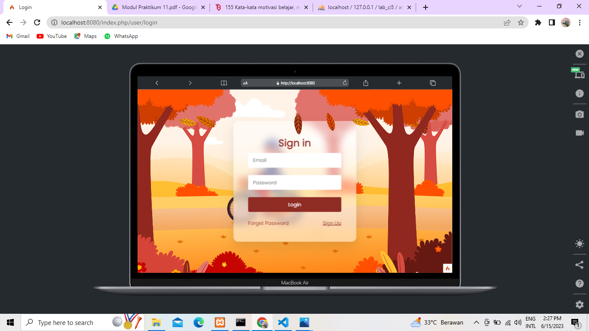
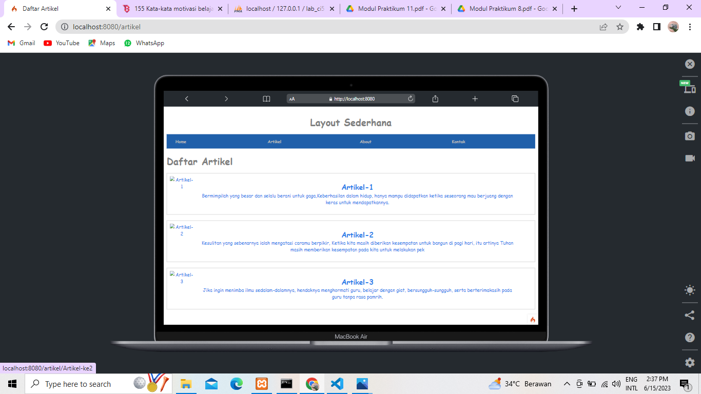

# Lab10-web
# 
---
Berikut ini adalah output dari Penambahan **Fitur logout,show password dan unggah gambar pada tambah artikel**

## Output
---

- **Database PhpMyAdmin**

- **Tampilan laman LOGIN**

- **Tampilan ketika check box show password di klick**

- **Tampilan ketika sudah berhasil LOGIN dan masuk ke dalam ARTIKEL ADMIN**

- **Tampilan tambah ARTIKEL**

- **ketika mengklick tombol choose file, langsung masuk kedalam file untuk memilih gambar**

- **Tampilan Edit ARTIKEL**

- **Tampilan setelah klick tombol LOGOUT**

- **Laman ARTIKEL**

- **Laman Artikel Detail**

# TERIMA KASIH 
